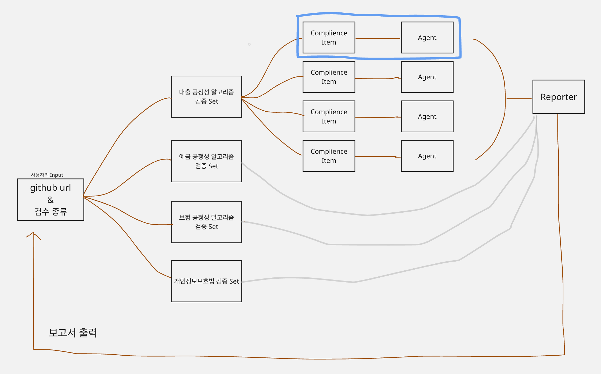

# Kompline

> 금융권, 레그테크 기업 등 대내외 규정·법령·표준 인증 준수 상태를 지속적으로 증명하는 멀티 에이전트 컴플라이언스 시스템

## 데모

- 로컬 실행: 아래 설치/실행 절차 참고

## 문제 정의

금융·안보 등 규제 산업에서는 국내외 법률, 산업 표준, 사내 규정 등 복잡한 규정을 지속적으로 준수해야 합니다. 하지만 현재의 주기적 감사는 감사자와 피감사자 모두에게 큰 업무 부담을 주며, 감사 사이의 공백과 인적 오류로 인해 규정 위반 리스크가 상존합니다.

## 솔루션

Kompline은 코드·로그·데이터 등 기업 산출물을 상시 스캔해 규정 준수 상태를 지속적으로 증명합니다.  
감사자에게는 자동 점검 및 리포팅, 피감사자에게는 증빙자료 생성, 실무자에게는 업무 착수 전 규정 적합성 사전 검토를 제공해 감사 비용을 절감하고 리스크를 조기에 대응합니다.

### 주요 플로우
1. 규정 문서 업로드 → Compliance Item 자동 추출
2. 소스코드/스키마 연결 → Scan 요청
3. 멀티에이전트 분석 → 항목별 Pass/Fail 판정
4. 리포트 자동 생성

## 조건 충족 여부

- [x] OpenAI API 사용
- [x] 멀티에이전트 구현
- [x] 실행 가능한 데모

## 아키텍처



## 기술 스택

- Python 3.10+
- FastAPI, Supabase, OpenAI API
- Next.js (Frontend)

## 설치 및 실행

### 1) 환경 변수

루트 `.env` 또는 각 서비스 디렉터리의 `.env`에 다음을 설정하세요.

```bash
# OpenAI
OPENAI_API_KEY=sk-your-key
OPENAI_BASE_URL=https://api.openai.com/v1
GPT_MODEL=gpt-4o-mini

# Supabase
SUPABASE_URL=https://your-project.supabase.co
SUPABASE_SERVICE_ROLE_KEY=sb_secret_xxx
SUPABASE_ANON_KEY=sb_public_xxx
```

Frontend (`frontend/.env.local`)에는 다음을 설정하세요.

```bash
NEXT_PUBLIC_SUPABASE_URL=https://your-project.supabase.co
NEXT_PUBLIC_SUPABASE_ANON_KEY=sb_public_xxx
```

### 2) Supabase 스키마 적용

아래 두 파일을 Supabase에 적용합니다.

1) `supabase/schema.sql` (documents + compliance_items)
2) `agents/sql/scan_schema.sql` (scans + scan_results)

### 3) Agents 실행

```bash
cd agents
python -m venv .venv
source .venv/bin/activate  # Windows: .venv\Scripts\activate
pip install -r ../compliance_extractor/requirements.txt

python -m agents.run orchestrator
python -m agents.run validator
python -m agents.run reporter
```

### 4) Frontend 실행

```bash
cd frontend
npm install
npm run dev
```

## 향후 계획

- 개인정보보호법, 데이터3법, 회계감사인증, 인증 감사 등 다양한 감사 전략에 대응
- DB 스키마 분석 (암호화 필드 검증)
- GitHub CI/CD 연동 (PR 단위 검증)
- 대출비교, 보험비교 플랫폼 규정 확장

## 팀원

| 이름 | 역할 |
| ---- | ---- |
| 백지오 | 팀장, Product Engineer |
| 윤병인 | Product Engineer |
| 문봉오 | Product Engineer |
| 박준영 | Product Engineer |
